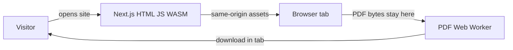

# PDFForge

PDFForge is a privacy-first PDF utility suite. The Next.js app is only a shell: **every document operation runs in the visitor’s browser**. Files, extracted text, metadata, and passwords are not uploaded, stored on a server, or sent to a third-party processing API.

The public product name is **PDFForge**. Older Figma frames may still show the placeholder brand “PDFLocal.”

## Why this architecture

Typical “online PDF tools” send your file to a conversion server. PDFForge inverts that:



Extra users cost the host **bandwidth for JS/OCR assets**, not CPU for their PDFs. Do not add an upload or conversion API to “scale”; that would break the privacy model.

## Architecture

### Layers

| Layer                           | Responsibility                                                                                                    |
| ------------------------------- | ----------------------------------------------------------------------------------------------------------------- |
| **Edge / Node**                 | Serve pages, hashed `/_next/static` files, `/ocr` WASM/lang data, `/sw.js`. `GET /health` for probes. No PDF I/O. |
| **Next.js App Router**          | Marketing routes, SEO, CSP nonces in [`src/proxy.ts`](src/proxy.ts), tool pages at `/tools/[slug]`.               |
| **React workspaces**            | UI only. They never mutate PDF bytes themselves.                                                                  |
| **`src/lib/*`**                 | Validation, PDF.js rendering/text, pdf-lib edits, OCR, OOXML/HTML convert, recipes.                               |
| **`src/workers/pdf.worker.ts`** | Isolated thread for merge/split/organize and other mutations.                                                     |
| **Browser**                     | File API, memory, downloads. Optional PWA shell cache (never document bytes).                                     |

### Request vs document path

- **Host may see:** public paths (`/`, `/tools/merge-pdf`), hashed static URLs. Access logs must not include filenames or query strings that might name files.
- **Host must not see:** PDF bytes, passwords, extracted text, OCR output, hashes of user files beyond what the user keeps locally.

Security headers and a nonce-based Content-Security-Policy apply on HTML. PDF.js workers, Tesseract, and fonts are **same-origin** (`public/ocr`, vendor copies). No CDN on the document-processing path.

### Repository layout

```text
pdfforge/
├── src/
│   ├── app/                 # Routes: /, /tools, /tools/[tool], /workspace, /privacy, /about, /offline, /health
│   ├── proxy.ts             # CSP nonce + security headers
│   ├── components/
│   │   ├── layout/          # Header, footer, page shell
│   │   ├── pdf/             # Uploader, thumbnails (no byte mutation)
│   │   ├── tools/           # Per-tool workspaces
│   │   ├── privacy/         # Cleanup, hash-URL, extension guard
│   │   └── pwa/
│   ├── config/              # tools.ts, SEO, site URL, security headers
│   ├── hooks/               # Worker orchestration
│   ├── lib/
│   │   ├── pdf/             # pdf-lib / PDF.js operations
│   │   ├── convert/         # PDF → Word / Excel / PPT / HTML (client)
│   │   ├── scan/            # Camera flatten + on-device OCR
│   │   ├── recipes/         # Private Recipes pipeline
│   │   ├── privacy/         # Persistence rules, cleanup
│   │   ├── workers/         # Worker client and lifecycle
│   │   └── files/           # Intake validation
│   └── workers/             # pdf.worker.ts
├── public/                  # sw.js, icons, /ocr WASM and English tessdata
├── deploy/nginx/            # TLS reverse proxy for Docker/VPS
├── tests/                   # unit, e2e, fixtures
├── docs/                    # architecture, privacy audit, release, acceptance
├── Dockerfile               # Multi-stage standalone image
├── docker-compose.yml       # Local HTTP (port 8080)
└── docker-compose.prod.yml  # HTTPS overlay
```

UI components call libraries; libraries may post work to the PDF worker. That keeps React free of raw `Uint8Array` mutation.

### Tools (by category)

Defined in [`src/config/tools.ts`](src/config/tools.ts).

| Category | Tools                                                                                        |
| -------- | -------------------------------------------------------------------------------------------- |
| Organize | Merge, Split, Organize, Private Recipes                                                      |
| Convert  | Scan Document, Images to PDF, PDF to Images, PDF to Word / Excel / PPT / HTML                |
| Edit     | Rotate, Watermark, Page numbers, Headers/footers, Extract text                               |
| Privacy  | Privacy Risk Scanner, Privacy Inspector, Remove/view metadata, Find & redact PII, Redact PDF |
| Security | Password protect, Unlock, Flatten, Document Integrity                                        |

Conversion and OCR use the in-tab text layer and optional on-device English Tesseract. They are not desktop-publisher reconstructions of layout.

## Feature enhancements

Shipped on top of the original Merge-first roadmap. All of these still run **in the tab**.

| Area     | What was added                                                                                                                               |
| -------- | -------------------------------------------------------------------------------------------------------------------------------------------- |
| Privacy  | Privacy Inspector (metadata, JS, hidden text, EXIF); Privacy Risk Scanner (Aadhaar, PAN, cards, emails, IFSC) with optional raster redaction |
| Convert  | PDF → Word, Excel, PowerPoint, HTML via OOXML/JSZip; OCR on pages with no selectable text (same engine as Scan Document)                     |
| Capture  | Scan Document: camera/photos, perspective flatten, searchable PDF                                                                            |
| Workflow | Private Recipes: chain steps (merge, numbers, watermark, strip metadata, protect) in one local session                                       |
| Trust    | Document Integrity: SHA-256/512 fingerprint, compare two files, verify a known hash                                                          |
| Hosting  | Docker + nginx (cache static/OCR, `no-store` on `/sw.js`), `/health`, Vercel without `standalone`                                            |

### Next enhancements (keep local-first)

These are the honest gaps—not a conversion microservice.

- **Office fidelity:** reconstruct tables, fonts, and vector art better in DOCX/XLSX/PPTX without uploading files.
- **OCR languages:** ship more tessdata packs same-origin (beyond English).
- **Redact/unlock:** fewer rasterized pages; broader AES-128 / annotation flatten coverage.
- **PWA:** cache tool chunks so a tool works offline on first visit; reuse the PDF worker after password jobs.
- **CSP:** tighten `style-src` (today it still allows `'unsafe-inline'`).
- **Product:** custom domain on Vercel or VPS; Lighthouse/performance pass on a real origin.

Do **not** “enhance” by adding file-upload APIs, PDF queues, or a third-party CDN for `pdf.worker` / Tesseract.

## Stack

- Next.js 16 App Router, React 19, TypeScript (strict)
- Tailwind CSS 4
- `pdfjs-dist` — parse, render, text
- `pdf-lib` + `pdf-lib-encrypt` — mutations, AES-256 protect/unlock
- JSZip — ZIP and Office Open XML
- Tesseract.js — English OCR, assets copied to `public/ocr`
- Vitest, Playwright, ESLint, Prettier, GitHub Actions

## Routes

| Path                             | Role                                          |
| -------------------------------- | --------------------------------------------- |
| `/`                              | Landing                                       |
| `/tools`                         | Directory (category in the URL hash)          |
| `/tools/[slug]`                  | Indexed tool page + workspace                 |
| `/workspace#slug`                | Noindex workspace (tool name not in the path) |
| `/privacy`, `/about`, `/offline` | Policy, product, PWA fallback                 |
| `/health`                        | Liveness JSON, `noindex`                      |
| `/sitemap.xml`, `/robots.txt`    | Public routes only                            |

## Privacy invariants

- No document bytes or derived content to an application server or third party.
- Do not log filenames, document text, metadata, passwords, or errors that may contain them.
- In-memory buffers and object URLs by default; IndexedDB only for explicit temporary recovery.
- Revoke object URLs, terminate workers, and drop temporary records after success, cancel, or leave.
- Self-host processing scripts. No analytics SDK that can see documents.

Full audit: [`docs/privacy-audit.md`](docs/privacy-audit.md). Design record: [`docs/architecture.md`](docs/architecture.md).

## Prerequisites

- Node.js **24** (see `.nvmrc`). `pdfjs-dist` needs Node `>=22.13.0`.
- npm with the committed `package-lock.json`.

## Local development

```bash
npm ci
npm run dev
```

Open [http://localhost:3000](http://localhost:3000). Copy `.env.example` if you need `NEXT_PUBLIC_SITE_URL` (canonical URLs and sitemap).

### Quality

```bash
npm run lint
npm run typecheck
npm run test:unit
npm run audit
npm run release:check
npm run build
npx playwright install chromium firefox webkit   # once
npm run test:e2e
```

E2E serves the production build on port **3100**. Run `npm run build` first if that output is stale.

## Run in Docker (this machine)

Port **80** is often already used (for example WSL nginx). Compose publishes **8080**:

```bash
docker compose up -d --build
```

Open **http://127.0.0.1:8080** — not `http://localhost` if port 80 is another server.

HTTPS overlay (self-signed or Let’s Encrypt files in `deploy/certs/`):

```bash
docker compose -f docker-compose.yml -f docker-compose.prod.yml up -d --build
```

Then **https://127.0.0.1:8443** when 443 is busy. Details: [`docs/release.md`](docs/release.md).

## Public hosting

| Option          | When to use                                                                                                                         |
| --------------- | ----------------------------------------------------------------------------------------------------------------------------------- |
| **Vercel**      | Public `https://….vercel.app` without a VPS. Import the GitHub repo; root is this directory. `output: "standalone"` is Docker-only. |
| **VPS + nginx** | Your domain, HSTS, cache `/_next/static` and `/ocr`, `no-store` on `/sw.js`.                                                        |

Set `NEXT_PUBLIC_SITE_URL` to the public origin before a production build (Vercel can fall back to `VERCEL_URL`). Staging and rollback: [`docs/acceptance.md`](docs/acceptance.md), [`docs/release.md`](docs/release.md).

## Further docs

- [`docs/architecture.md`](docs/architecture.md) — phase history and constraints
- [`docs/privacy-audit.md`](docs/privacy-audit.md) — threat model
- [`docs/release.md`](docs/release.md) — Docker, nginx, Vercel, rollback
- [Figma prototype](https://www.figma.com/proto/eSdbWCDJ0EqKUPESoR66nx/PDFLocal-%E2%80%94-Privacy-First-PDF-Tools?node-id=0-1) (PDFLocal placeholder branding)
